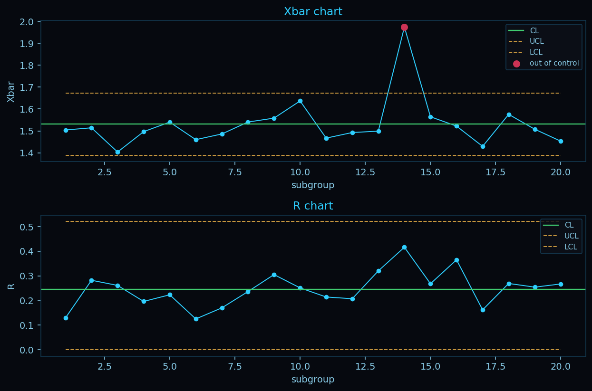

# mfgQC

mfgQC is a quality-control library for Python, written for manufacturing
practitioners rather than statisticians. It runs process capability, control charts,
gage R&R, and the rest of the SPC toolkit. Every analysis checks its own assumptions
and reports them, and every result keeps a verifiable record of how it was computed.

[](https://pypi.org/project/mfgqc/)
[](https://pypi.org/project/mfgqc/)
[](https://github.com/cjbrant/mfgQC/blob/main/LICENSE)
[](https://github.com/cjbrant/mfgQC/actions/workflows/tests.yml)

## Install

```bash
pip install mfgqc
```

Requires Python 3.10 or newer. It pulls in NumPy, pandas, SciPy, Matplotlib,
statsmodels, and scikit-learn.

## A first analysis

Load a tidy table, attach the spec limits, and run an analysis. Every result has the
same surface: `.report()` for text, `.summary()` for a flat dict, `.to_dict()` for the
full payload, and `.view()` for the chart.

```python
import pandas as pd, mfgqc

qc = (mfgqc.load(df, measure="width", subgroup="lot", subgroup_size=5)
           .spec(lower=1.0, upper=2.0, target=1.5))

print(qc.control_chart())   # the right chart for the subgroup size, with run rules
print(qc.capability())      # Cp, Cpk, Pp, Ppk, plus an assumption report
```



## What it is built on

1. **Statistical guardrails.** Every analysis checks its own assumptions and reports
   the outcome. It warns and recommends, and it never silently switches methods.
   Auto-correction is opt-in.
2. **Practitioner oriented.** You bring the domain knowledge. mfgQC brings the
   statistics, the data handling, and the canonical charts. Errors say what is missing
   and why.
3. **Auditable by construction.** Data and result objects are immutable and carry a
   hash-chained provenance history, so the path from raw data to a final number can be
   reconstructed and verified.

## What it covers

| Area | Methods |
| --- | --- |
| Capability | Cp/Cpk, Pp/Ppk, Cpm with confidence intervals; Box-Cox, Clements, and Johnson for non-normal data |
| Control charts | I-MR, X-bar R/S, p/np/c/u, EWMA, CUSUM, short-run; Western Electric and Nelson run rules |
| Measurement systems | ANOVA gage R&R, bias, linearity, stability, attribute agreement |
| Hypothesis testing | assumption-routing t / variance / proportion tests, ANOVA, post-hoc, non-parametrics |
| Regression and DOE | OLS, model selection, logistic, non-linear least squares; full and fractional factorials |
| Power and sampling | sample size for t / ANOVA / proportion; ANSI/ASQ Z1.4 and Z1.9 acceptance plans |
| Reliability | life-distribution fitting with censoring, Kaplan-Meier, system reliability, MTBF, availability |
| Bayesian analytics | posterior capability, proportion and rate, and comparison; assurance sample size, guardband, Phase-1 monitoring; hierarchical pooling, censored and short-run |

## Where to start

- The [Quickstart](guide/quickstart.ipynb) takes you from a table to a result. Every page in the User Guide is a runnable notebook you can open in Colab.
- The [Reference](reference/index.md) gives the formula, the assumptions, and the source standard behind each method.
- The source is on [GitHub](https://github.com/cjbrant/mfgQC) and the package is on [PyPI](https://pypi.org/project/mfgqc/). MIT licensed.
